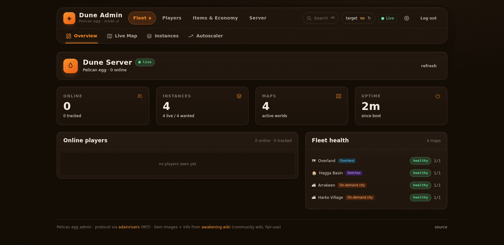
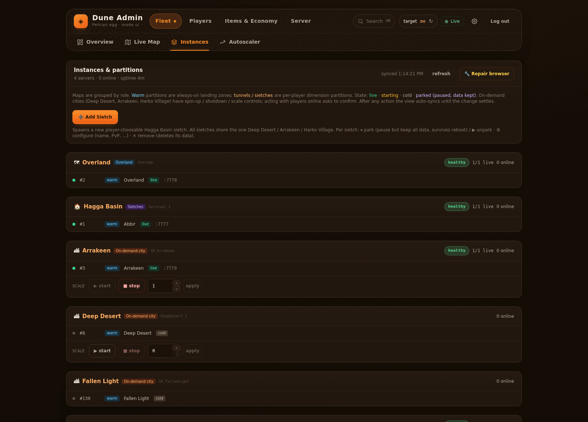
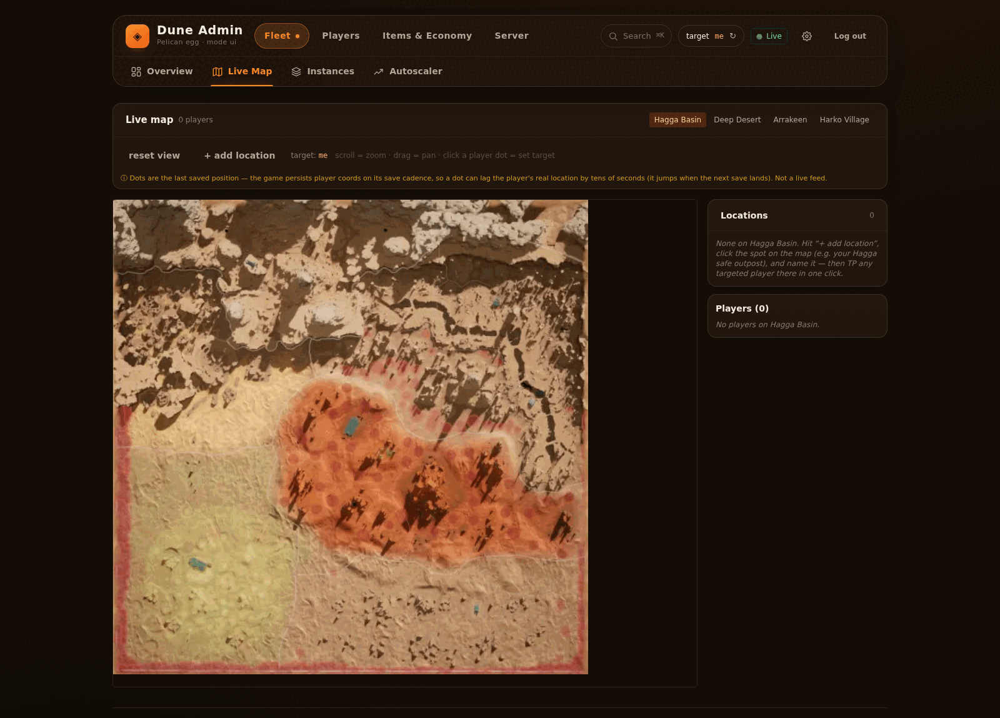
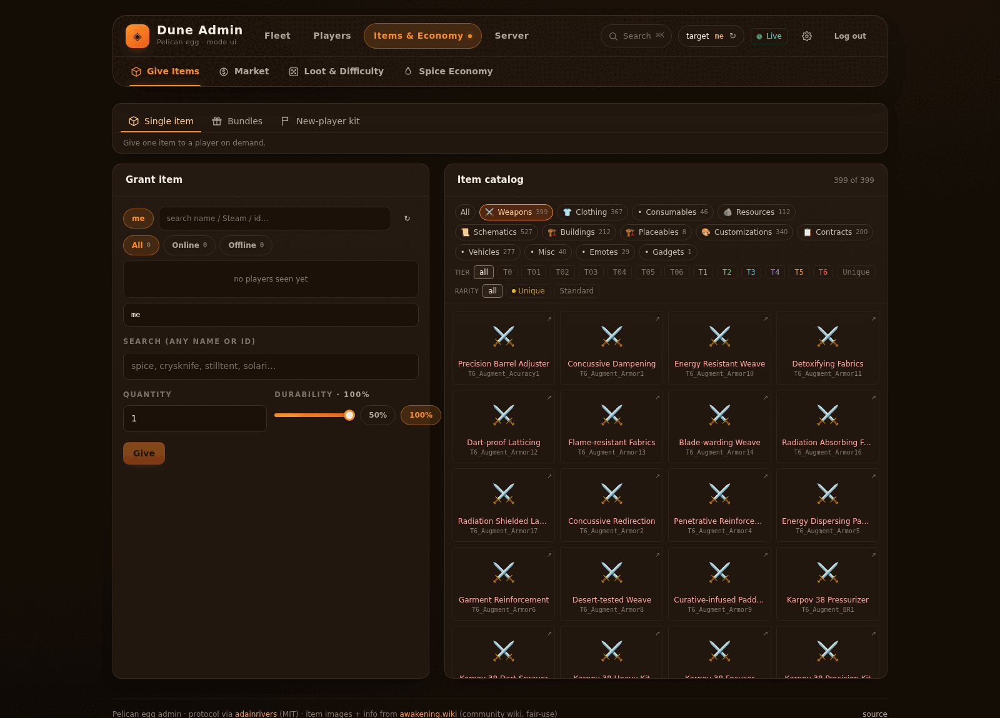
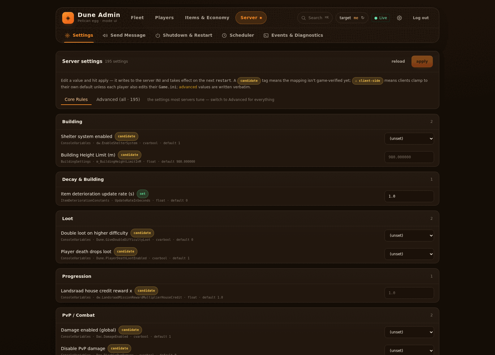

# Dune: Awakening — Pelican egg (native Linux, Docker)

A [Pelican](https://pelican.dev/) (and [Pterodactyl](https://pterodactyl.io/)) egg
that runs a **full Dune: Awakening dedicated server battlegroup on Linux Docker**
— no Hyper-V, no Kubernetes, no Windows host required, no AMP runtime.

This project is **Pelican-native**. The architecture was originally
reverse-engineered by [CubeCoders Limited](https://cubecoders.com/) for their
AMP product and published as MIT-licensed scripts at
[CubeCoders/AMPTemplates](https://github.com/CubeCoders/AMPTemplates). We
forked their scripts, ported the model to Pelican Wings, rewrote
`mock-k8s-go` as an open-source Go binary (their original was closed and
refused to run outside AMP), and added a panel-driven config-applier for
25 game-side tunables (loot multipliers, sandstorms, sandworms, PvP zones,
building limits, player hard cap, on-demand pool tuning) on top of a
195-setting catalogue driven from the admin UI. See
[`ATTRIBUTION.md`](./ATTRIBUTION.md) for the full credit + license discussion.

## How it works

Funcom's official self-host bundle is a Hyper-V VM image plus a Kubernetes
cluster that runs game-server pods inside the VM. That setup only works on
Windows Pro.

But the binaries Funcom puts on Steam (the `4754530` Production depot and
`3104830` PTC depot) are **native Linux ELFs** packaged as 7 OCI image
tarballs:

| OCI image | Contents |
|---|---|
| `igw-postgres` | Postgres 17.4 (musl) |
| `server-rabbitmq` | RabbitMQ 3.13 + Erlang OTP 26 (musl) |
| `server-bg-director` | Battlegroup Director (.NET AOT, musl) |
| `server-text-router` | Text Router (.NET AOT, musl) |
| `server-gateway` | Gateway Service (Python 3.12, musl) |
| `server-db-utils` | ToolsDB / resetdb (Python 3.12, musl) |
| `server` | UE5 dedicated server (glibc) |

The trick is twofold:

1. `patchelf --set-interpreter` each musl-linked binary so it uses its own
   image's bundled `ld-musl-x86_64.so.1` loader — letting them run on Debian
   glibc.
2. A small Go **mock Kubernetes API** (`scripts/mock-k8s-go`) that the
   Battlegroup Director talks to instead of a real K8s cluster. The Director
   thinks it's launching pods; mock-k8s spawns UE5 server processes directly.

The egg wires this up against Wings.

## Admin panel

Optional web UI, off by default — set `DUNE_ADMIN_UI_ENABLED=1` and it is served
by `admin-http.py` on the port you allocate. It runs against the same server-side
admin pipeline as the console commands below, so anything the panel does can also
be scripted.



<table>
<tr>
<td width="50%"><a href="docs/img/admin-instances.png"></a></td>
<td width="50%"><a href="docs/img/admin-map.png"></a></td>
</tr>
<tr>
<td><b>Instances &amp; partitions</b> — every map with its real partition id and
port, grouped by role (always-warm landing zones, per-player dimension
partitions, on-demand cities). Start, stop, scale or park a Sietch without
touching the DB.</td>
<td><b>Live map</b> — player positions per map, drawn from the last saved
coordinates. Drop named locations and teleport a targeted player to one in a
single click.</td>
</tr>
<tr>
<td><a href="docs/img/admin-items.png"></a></td>
<td><a href="docs/img/admin-settings.png"></a></td>
</tr>
<tr>
<td><b>Items &amp; economy</b> — the full 2,558-item catalog with tier and
rarity filters, single grants, bundles and a new-player kit.</td>
<td><b>Server settings</b> — 195 tunables mapped to their real INI keys, with
Funcom's defaults shown. Values are written to the server INI and take effect
on the next restart. The 25 that are backed by a panel variable have that
variable updated too, so the restart no longer reverts what you just changed.</td>
</tr>
</table>

> Screenshots are from a freshly-booted battlegroup, which is why the player
> lists are empty.

**Scheduled restart** — pick a delay (presets from 5 min to 16 h, or type a
value in seconds/minutes/hours), and the panel restarts the server through
the Pelican/Pterodactyl power API when it runs out. The in-game countdown
only starts a window you choose before the restart, so a restart hours away
does not banner players the whole time — the game re-shows the notice every
interval until the deadline, which at a 60-second interval over 8 hours is
480 banners. The card shows how many players will actually see.

**Command audit** — every admin action that changed something is kept in
`server/state/admin-history.db`, so it survives a restart, a `panel restart`
and an egg reinstall. Read-only polling is not recorded: the live map polls
every 4 seconds, and that used to evict every real action from the buffer
within a quarter of an hour.

### Exposing the panel

The panel speaks plain HTTP and never terminates TLS itself. Two variables
decide how it behaves behind a proxy — both optional, both safe left at
their defaults, and the boot log states which mode is in effect:

| Variable | What it is for |
|---|---|
| `DUNE_ADMIN_UI_TLS` | `auto` (default), `on`, `off`. Session cookies carry `Secure` when TLS is believed to be in front. A browser **discards** a `Secure` cookie arriving over plain HTTP, so a domain pointed straight at an exposed box needs `off` — otherwise login answers 200 and the login screen simply comes back. |
| `DUNE_ADMIN_UI_TRUSTED_PROXIES` | IPs/CIDRs whose `X-Forwarded-For` is believed. Without it every request behind a proxy arrives from the proxy, so the login rate limit becomes one global bucket and five failures from anywhere lock the operator out. |

The listener is threaded, capped (`DUNE_ADMIN_HTTP_MAX_CONNS`, default 64)
and has a per-connection timeout (`DUNE_ADMIN_HTTP_TIMEOUT_SECS`, default
30). Before that, a single connection that opened and said nothing wedged
the whole panel until the container was restarted — which is what internet
scanners do to a `0.0.0.0` bind within hours.

## Admin commands

Server-side admin pipeline ships with the egg — bypasses the locked
in-game console. Type `admin <subcommand>` in the Pelican panel's
**Console** tab, or POST to the loopback HTTP wrapper:

```text
admin players                                       # list FLS ids
admin broadcast "Maintenance" "Restart in 5 min" 20 # server-wide banner
admin give me AAR1_Spice 100                        # 'me' = single online account
admin xp steam:76561198041278656 10000              # resolve from Steam id
admin teleport DE0BCCAA2501BF22 101000 285000 4300  # canonical FLS id
admin shutdown Restart 300 60                       # countdown banner — announces only
```

`admin shutdown` **announces and nothing else** — it shows players a
countdown banner but stops, restarts and shuts down nothing. To actually
restart, use the panel's **Scheduled restart** card or the Scheduler tab;
both arm a restart that calls the panel's power API when the countdown ends.

The same console also takes `panel <status|restart|stop>`, which acts on the
admin panel process rather than the game — useful if the panel becomes
unreachable while the server is fine. The restart re-reads the password and
session secret from `server/state/`, so browser sessions survive it, and no
player is disconnected.

In-game character names (`Sergentval`, etc.) cannot be used — Funcom
stores them encrypted. Use the FLS id (from `admin players`),
`me`, `steam:<id>`, or `*`.

Lookup helpers (panel console):

```text
admin vehicles                   # 9 vehicle classes + their templates
admin items spice                # search 2558 items (case-insensitive)
admin skills swordmaster         # search 145 skill modules by category
```

Full catalogue (15 subcommands), payload schemas, examples,
no-op caveats, and troubleshooting in
[`docs/ADMIN-COMMANDS.md`](./docs/ADMIN-COMMANDS.md).
Copy-paste recipes by scenario (welcome kit, vehicle spawn, event
prep, scheduled restart) in
[`docs/ADMIN-RECIPES.md`](./docs/ADMIN-RECIPES.md). Item-grant
catalogue grouped by faction and tier (Atreides / Harkonnen /
Smuggler weapon families, armor sets, augments, B1C4 unique drops)
in [`docs/ADMIN-TIER-ITEMS.md`](./docs/ADMIN-TIER-ITEMS.md).
Self-host admin-surface feedback for Funcom (missing commands,
partial implementations, the 35-candidate negative-result list)
in [`docs/ADMIN-FUNCOM-GAPS.md`](./docs/ADMIN-FUNCOM-GAPS.md).
Protocol reverse-engineering credit:
[adainrivers/dune-dedicated-server-manager](https://github.com/adainrivers/dune-dedicated-server-manager)
(MIT). See [`ATTRIBUTION.md`](./ATTRIBUTION.md).

## Status

The egg has been running a production world end-to-end (real players,
characters created, persistent save). The current code path:

- `egg-dune-awakening.json` — **Pelican** egg (`PLCN_v1` format), 55 panel
  variables (FLS token + game-side tunables + infrastructure ports). Install
  script fetches our repo tarball from GitHub, no upstream race.
- `egg-dune-awakening-pterodactyl.json` — same egg in **Pterodactyl**
  `PTDL_v2` format (pipe-string rules + `field_type`, single `startup`
  string). Import this one on Pterodactyl panels; the `PLCN_v1` file above
  also imports on Pelican. Both expose the identical 55 variables.
- `docker/Dockerfile` — Debian Bookworm-slim runtime with required apt
  deps, tini as PID 1, K8s ServiceAccount mount declared as VOLUME.
  Published to
  [`ghcr.io/sergentval/pelican-dune-awakening:latest`](https://github.com/Sergentval/pelican-egg-dune-awakening/pkgs/container/pelican-dune-awakening).
- `scripts/` — vendored fork of CubeCoders' launch scripts with our
  Pelican-specific fixes (graceful shutdown grace periods, Funcom DB
  migration regression workarounds, partition ID handling, etc.). All
  AMP-isms stripped.
- `mock-k8s/` — open-source Go re-implementation of CubeCoders'
  closed mock-k8s binary, built from source at install time.
- `scripts/apply-config.sh` + `scripts/pelican-entrypoint.sh` — our own
  contributions for Pelican-side panel-variable substitution and
  foreground orchestration.

## Project layout

```
pelican-egg-dune-awakening/
├── README.md                    ← you are here
├── ATTRIBUTION.md               ← credit + MIT lineage
├── LICENSE                      ← MIT (CubeCoders + this fork's edits)
├── NOTICE                       ← attribution summary
├── egg-dune-awakening.json              ← Pelican egg (PLCN_v1)
├── egg-dune-awakening-pterodactyl.json  ← Pterodactyl egg (PTDL_v2)
├── docker/
│   ├── Dockerfile               ← runtime image
│   ├── README.md                ← build / push / smoke-test instructions
│   └── .dockerignore
├── mock-k8s/                    ← our open-source Go replacement
│   ├── cmd/mock-k8s/main.go
│   ├── go.mod, go.sum
│   └── internal/...
├── web/                         ← admin panel SPA (React + Vite)
│   └── src/                     ← built into data/web/dist, served by admin-http
└── scripts/                     ← vendored from CubeCoders, modified
    ├── UPSTREAM-README.md       ← historical CubeCoders README
    ├── pelican-entrypoint.sh    ← our foreground orchestrator
    ├── apply-config.sh          ← our panel-variable INI applier
    ├── install.sh, console.sh, prestart.sh, lib.sh, ...  (27 .sh files)
    ├── admin-http.py            ← admin API + SPA host
    ├── admin_schedule.py        ← unattended restart/backup scheduler
    ├── admin_pelican.py         ← Pelican/Pterodactyl client-API access
    ├── admin_history.py         ← persisted command audit
    ├── admin_*.py               ← 22 modules total, one per admin domain
    ├── test_*.py                ← 25 suites, run with plain python3
    └── templates/director.ini
```

Note: `scripts/mock-k8s-go` is not in git. It is built deterministically
in the install container from `mock-k8s/cmd/mock-k8s/` with
`CGO_ENABLED=0 go build -trimpath -ldflags='-s -w'`.

## Hardware requirements (per battlegroup)

- 6 CPU cores minimum / 8 recommended (AVX2 required)
- 32 GB RAM minimum / 64 GB recommended
- ~50 GB disk (depot + state)

A "battlegroup" is one world. It hosts multiple "Sietches" (always-warm hub
maps + on-demand instances for dungeons / story missions / Deep Desert) on
a shared UDP port pool.

### Wings limits — check these before blaming the hardware

Having enough RAM in the machine is not enough. Wings runs the server inside
a container with **its own limits**, and a process that hits one of those is
killed while the host still shows free memory. Both of these have bitten real
deployments (see issue #82):

| Limit | Where | Symptom when too low |
|---|---|---|
| **`container_pid_limit`** | `/etc/pelican/config.yml` on the Wings node (default **512**) | **The one that bites first.** `director` or `text-router` dies reporting **"Out of memory"** on a machine with tens of GB free, UE5 instances fail to spawn past the third or fourth, and map transitions kill services at the moment a second instance comes up. Raise to **4096**, restart Wings, then restart the server so the container is recreated. |
| Server **Memory** | Panel → server → Build Configuration | A real cgroup memory ceiling. `director`/`text-router` are .NET services run with `DOTNET_RUNNING_IN_CONTAINER=true`, so they size their GC heap from the cgroup limit, not host RAM — a tight limit starves them long before the host is full. Set **Unlimited**, or comfortably above peak. |

**Why "Out of memory" is a red herring here.** The cgroup pids controller counts
**threads, not processes**, and 512 is a shared budget for the whole container:
every UE5 Sietch, Postgres, both RabbitMQ brokers and the .NET services together.
One battlegroup with three always-warm maps blows through it easily. When
`pthread_create` then fails with `EAGAIN`, the .NET runtime surfaces it as
`OutOfMemoryException` — so the log says "Out of memory" while free RAM is
plentiful and the kernel OOM killer never fires. If you see that combination,
check `container_pid_limit` before you touch RAM. (Confirmed in issue #82:
Memory was already Unlimited and the OOM killer disabled; the pid limit was the
whole story.)

A dead `text-router` is especially misleading: it is the HTTP auth backend for
both RabbitMQ brokers, so when it dies **every** broker login is refused and
the Director reports `RMQ unreachable` / `ACCESS_REFUSED`. That reads like a
broker fault, but the broker is fine — check `logs/text-router.log` first.

## Port allocation

Assign these in the Pelican panel's **Allocations** tab when you create the
server. The **primary** allocation must be the UDP game base, `7777`.

| Protocol | Port(s) | Allocate? | Purpose |
|---|---|---|---|
| UDP | 7777–7806 | **Yes — whole range** | UE5 dedicated-server instance pool (30 slots; ~8 active by default). Primary = `7777`, wired to `SERVER_PORT` / `K8S_POOL_GAME_PORT_BASE`. Allocate the full range so on-demand maps and Deep Desert instances can bind. |
| TCP | 5673 | **Yes** | RabbitMQ game broker (AMQPS / TLS) — `DUNE_MQ_GAME_PORT` |
| TCP | 15673 | **Yes** | RabbitMQ game management, client token auth — `DUNE_MQ_GAME_MGMT_PORT` |
| TCP | 8090 | Optional | Admin web UI — only when `DUNE_ADMIN_UI_ENABLED=1` (`DUNE_ADMIN_UI_PORT`) |

The UDP range and the two TCP broker ports are advertised to clients via
Funcom's FLS service using `DUNE_EXTERNAL_IP` (your public WAN IP), so they
must also be open/forwarded on your router or firewall.

Everything else binds to `127.0.0.1` inside the container and needs **no**
allocation: Postgres (15432), mock-k8s API (6443), Battlegroup Director
(11717), gateway (8080), text-router (5059), RabbitMQ admin (5672 / 15672),
the IGW port pool (7950+), and the internal admin HTTP wrapper (8089).

## Setup

1. Get your **Self-Host Service Token** from
   [account.duneawakening.com](https://account.duneawakening.com/) (or
   `account-pts.duneawakening.com` for the PTC branch). Sign in with the
   Steam account that owns Dune: Awakening. **Each running server needs its
   own unique token.**
2. Build and push the runtime Docker image (see [`docker/README.md`](./docker/README.md))
   to a registry your Wings host can pull from, or use the published
   `ghcr.io/sergentval/pelican-dune-awakening:latest`.
3. In the Pelican panel: **Admin → Eggs → Import** → upload
   `egg-dune-awakening.json` → create a new server, paste the token into
   `DUNE_JWT`, set world title and region, deploy.
   On **Pterodactyl** (Admin → Nests → Import Egg) upload
   `egg-dune-awakening-pterodactyl.json` instead — the `PLCN_v1` file uses a
   Pelican-only format that Pterodactyl rejects with "The JSON file provided
   is not in a format that can be recognized."

The install fetches scripts + Go source from this repo's `main` branch by
default. Pin a tag or commit SHA via the `DUNE_EGG_REF` panel variable for
reproducible installs.

### Updating

Run **Reinstall** on the server. It re-fetches `scripts/`, `mock-k8s/` and
`data/` from the repo — and **does not touch your data**. Everything
persistent lives under `server/state/`, which the install never writes to:

| Kept | Where |
|---|---|
| Characters, bases, inventories, the whole game DB | `server/state/pg/data` |
| World saves and world identity | `server/state/ue5-saved`, `server/state/world-name` |
| `UserEngine.ini` / `UserGame.ini` / `director_config.ini` edits | `server/state/…` |
| Admin panel config, ledgers, command audit | `server/state/admin/`, `server/state/*.db` |

Two things a reinstall does **not** do. It does not update the egg
definition in your panel, so a release that adds a variable needs an
**egg re-import** (Admin → Eggs) before that variable appears — importing
over the existing egg matches it by UUID and keeps every value your server
already has. And it leaves the server stopped, so start it afterwards.

## Credits

See [`ATTRIBUTION.md`](./ATTRIBUTION.md) for the full credit list and MIT
lineage. Short version:

- **CubeCoders Limited** ([CubeCoders/AMPTemplates](https://github.com/CubeCoders/AMPTemplates))
  reverse-engineered the architecture and published the launch scripts
  under MIT. This egg would not exist without that work.
- **Funcom** ships the actual server binaries via Steam.
- This Pelican port — `valentin95150@hotmail.fr`.

## References

- AMP Dune Awakening setup guide:
  [discourse.cubecoders.com/t/dune-awakening-server-guide/40200](https://discourse.cubecoders.com/t/dune-awakening-server-guide/40200)
- Funcom self-host docs:
  [duneawakening.com/self-hosted-servers](https://duneawakening.com/self-hosted-servers/)
- Community Rust manager (Hyper-V + SSH-to-Ubuntu):
  [adainrivers/dune-dedicated-server-manager](https://github.com/adainrivers/dune-dedicated-server-manager)
